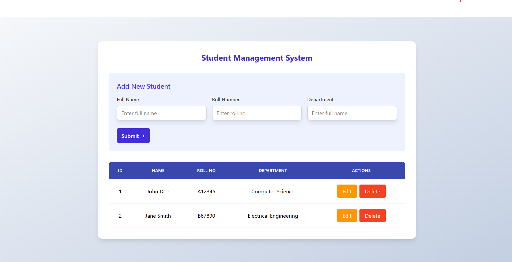

# Student Management System 📚

A simple and responsive student management system built using HTML, Tailwind CSS, and JavaScript. This web app allows you to easily add and display student details in a modern, mobile-friendly interface.

## 🌟 Features

- Add student information: Full Name, Roll Number, and Department
- Display all student records in a clean, tabular format
- Responsive table layout for mobile and tablet screens
- Beautiful UI with Tailwind CSS
- Easy to extend and customize

## ⚙️ Technologies Used

- HTML
- Tailwind CSS
- JavaScript

## 📸 Screenshots

Here is a preview of the Student Management System:



## 🚀 How to Run the Project

1. Clone the repository:
   ```bash
   git clone https://github.com/your-username/student-management-system.git

2. Navigate into the project folder:
   ```bash
   cd student-management-system

## 📁 Folder Structure
student-management-system/
├── Demo.png           ← App preview image
├── index.html         ← Main HTML file
├── input.css          ← Tailwind source file (optional)
├── output.css         ← Compiled Tailwind CSS file
├── script.js          ← JavaScript logic
├── package.json       ← NPM configuration
├── package-lock.json  ← NPM lock file
├── README.md          ← Project documentation
└── node_modules/      ← Project dependencies


## 🙌 Author

- [Ansari Soman](https://github.com/Ansari-Soman)

---

Feel free to use this project for learning or personal use!
